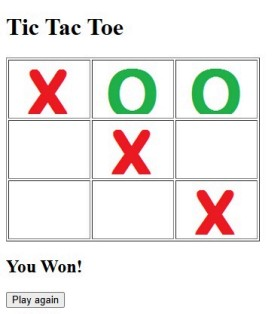
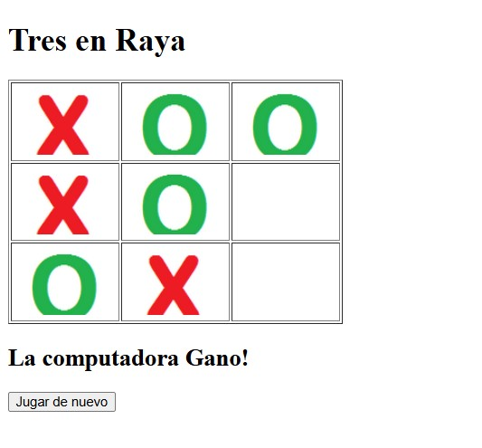
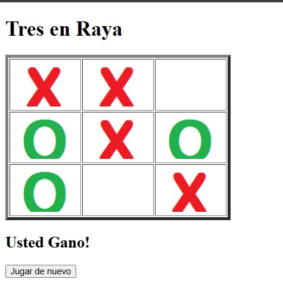
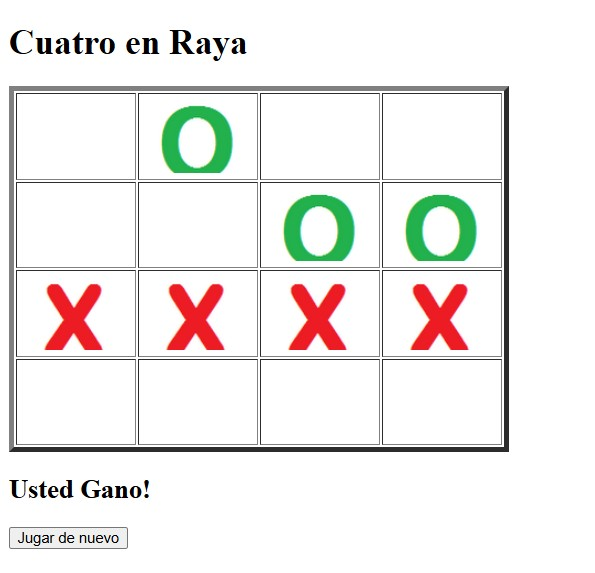

# TicTacToe - Tres en Raya

Este proyecto consiste en la implementación de un juego de **Tres en Raya** desarrollado con **Java, JSP y Servlets**.

El proyecto utiliza **Git y GitHub** para el control de versiones.

---

# Versión 1 - Juego original

Primera versión del juego Tic Tac Toe en inglés.

Características:
- Tablero de 3x3
- El usuario puede jugar contra la computadora
- La computadora realiza movimientos aleatorios
- Interfaz web con JSP

Ejemplo del juego:

---

# Versión 2 - Juego traducido al español

En esta versión se modificaron todos los mensajes del juego para que aparezcan en **español**.

Cambios realizados:
- "You start" → "Tú comienzas"
- "The computer starts" → "La computadora inicia"
- "You Won" → "Tú Ganaste"
- "The computer Won" → "La computadora ganó"
- "Nobody Won" → "Empate"

Ejemplo:

---

# Versión 3 - Mejora visual

En esta versión se modificó el **borde de la tabla** del juego.

Cambios realizados:
- Se aumentó el atributo `border` de la tabla en `game.jsp`.

Ejemplo:

---

# Versión 4 - Cuatro en Raya

En esta versión se modificó el tamaño del tablero.

Cambios realizados:
- Se modificó la constante:
GRID_SIZE = 3 por GRID_SIZE = 4

Esto permite jugar **Cuatro en Raya**.

Ejemplo:

---

# Tecnologías utilizadas

- Java
- JSP
- Servlets
- HTML
- Git
- GitHub
